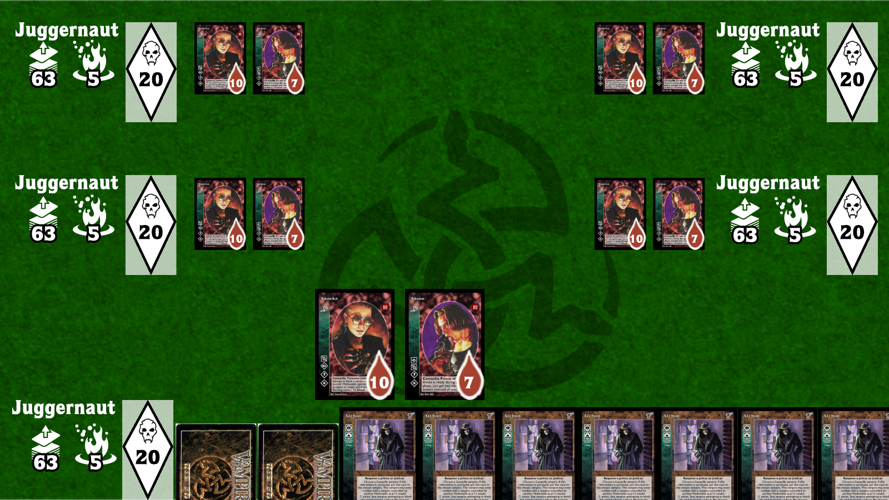
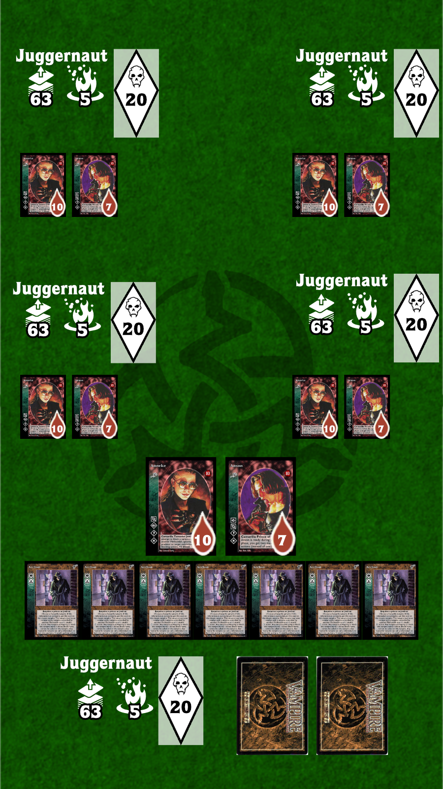
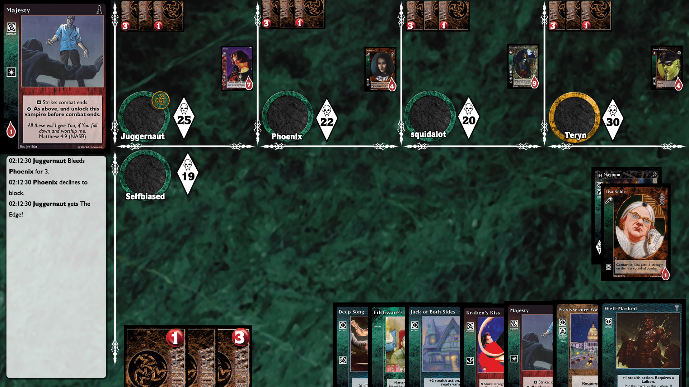

# User Interface

THIS DRAFT VERSION IS A WORK IN PROGRESS AND NOT YET AGREED UPON.

## User stories

A list of basic interface interactions and how they should be handled.

### Play / move a card

Default / automatic card placement, or at least a grid.
A way to stack/attach cards easily.

### Card interaction

Using a radial menu. "Act" can be separated from just "Lock", and display a secondary
menu with defult rulebook actions.
Having dedicated buttons for classic interactions may help us build
a better game experience for asynchronous play (eg. check a "no reaction" button).

### Toggle / target

An easy way to toggle or target a card (and log it).

### Torpor / uncontrolled

The torpor is not a zone, it is handled with an overlay.
Uncontrolled can be displayed the same way, as can any out-of-play card.
Note that some out-of-play cards are known by all (contests, Erciyes Fragment),
where others are secret (Mokole Blood). We will need to distinguish both cases.

### Turns & phases

For now, we'll handle the turns only, no button for individual phases.

## Layout proposals

## Backlog

These additional features are out of scope and may or may not be developed for V1:

- Avatar upload
- Run a colour blindness filters
